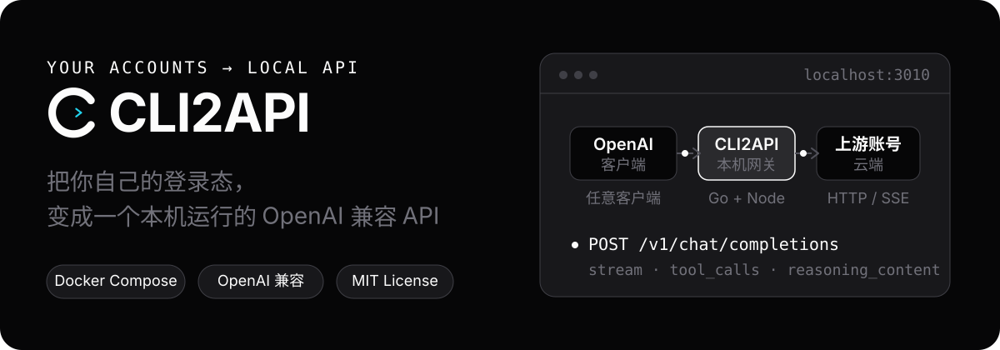

<div align="center">

# CLI2API

**把你自己的登录态，变成一个本机 OpenAI 兼容 API**

支持 **Qoder 国际版**、**Qoder 国内版**、**WorkBuddy 国际版**、**WorkBuddy 国内版**、**Trae 国内版 Work**，以及实验性的 **Devin**（`provider=devin`，浏览器 OAuth / session token 导入；尚未宣称生产可用）。

常驻运行时、多账号调度。请用 Docker 部署，这是官方支持的安装与更新路径。

[](LICENSE)
[](https://linux.do)

<sub>[English](README_EN.md) · [问题反馈](https://github.com/caigee-cmd/cli2api/issues) · [LINUX DO](https://linux.do)</sub>



</div>

## 功能

- **OpenAI / Anthropic 兼容代理**：`/v1/chat/completions`、`/v1/responses`、`/v1/messages`、`/v1/models`；支持流式/非流式、文本与函数工具调用。图片能力取决于 provider（当前 Qoder 支持，WorkBuddy / Trae 不支持），文件输入会明确拒绝。`messages` / `responses` 为无状态适配层，不支持服务端会话或上游专属工具
- **多渠道账号池**：地域隔离、账号固定、并发限制、冷却与同族故障切换
- **代理出口**：统一 HTTP(S) 代理，支持账号级覆盖，可用 `direct` / `none` 显式直连。SOCKS5 仅支持 WorkBuddy / Trae / Devin 的账号级代理，Qoder 账号级只支持 HTTP(S)
- **按 provider 支持多种登录方式**：浏览器 Device Flow OAuth、PAT，以及适用 provider 的凭证导入/导出
- **Web 控制台**：账号、模型、接入、请求历史与运行时日志；请求历史可按账号过滤，并查看状态、延迟、Token 与用量统计；明暗主题
- **账号保活**：WorkBuddy 每日签到与 token 保活（账号级开关，默认关闭；控制台可立即签到 / 刷新积分）
- **部署与运维**：Docker Compose 单容器、安全托管更新（升级前快照、失败自动回滚、直接最新稳定版、可回滚最近三个稳定版）、默认只监听 `127.0.0.1`；提供 `linux/amd64` / `linux/arm64` 镜像，macOS、Windows 通过 Docker Desktop 运行

## 快速开始

**强烈建议用 Docker 部署。** 发布镜像与控制台托管更新都按单容器 Compose 安装设计；从源码直接跑 Go / Node 不在这条更新路径上。

依赖：Docker（macOS / Windows 用 Docker Desktop，Linux 用 Docker Engine + Compose），以及一个你自己控制的 Qoder、WorkBuddy、Trae 或实验性 Devin 账号。Windows 的 Docker Desktop 必须切换到 Linux containers。

```bash
git clone https://github.com/caigee-cmd/cli2api.git
cd cli2api
./scripts/start.sh        # Windows 用 scripts\start.ps1
```

首次启动会生成随机 API Key 并在日志中打印一次，请先保存；打开 `http://127.0.0.1:3010` 登录控制台，在 **Accounts** 页面添加账号。详细步骤见 [部署说明](deploy/README.md)。

## 接入客户端

任何支持 OpenAI 兼容 API 的客户端（OpenAI SDK、Codex、CherryStudio 等）都可以直接接入：

```text
Base URL: http://127.0.0.1:3010/v1
API Key:  <首次启动时生成的 Key>
```

不指定账号时，调度器自动选择可用账号；需要固定账号时加请求头 `X-Qoder-Account: acc_...`（历史命名，适用于所有 provider）。同一段对话默认按首条用户消息（含纯图片）粘到同一个账号，也可显式设置 `X-CLI2API-Session`。curl / PowerShell 示例见 [部署说明](deploy/README.md)。

## 工作方式

<p align="center">
  
</p>

每个启用账号拥有独立运行时：Qoder 使用独立 Node 进程、HOME 和 WASM 上下文，WorkBuddy / Trae / Devin 使用进程内适配器。Go 负责账号持久化、调度、并发限制、冷却、失败切换，并管理需要子进程的 provider 生命周期。

## 控制台

<p align="center">
  
</p>

账号、模型、接入和日志都在同一个 Web 控制台里管理：就绪状态和额度一目了然，Access 页可以直接复制 Base URL 并做一次快速验证。

## 适合什么场景

- 想在本机或私有服务器上统一接入各上游账号，并在多个账号之间自动路由和故障切换
- 已经在使用 OpenAI API 格式的客户端或脚本，且不想每个请求都启动完整 CLI Agent

CLI2API 是本地网关：不提供账号、额度或官方 API 服务，不做多用户共享转售。

## Roadmap

**进行中**

- Qoder 国内版、WorkBuddy、Trae 国内版 Work 的真账号验收（登录、故障切换、混合账号池）

**长期**

- 更多上游渠道（Cursor 等）
- 可选的提示词 / 回复留档（显式开关，默认关闭）

## 文档

- [部署与运维：启动步骤、环境变量、接口、托管更新](deploy/README.md)
- [变更记录](CHANGELOG.md)

## 安全

默认只监听 `127.0.0.1:3010`；除 `/health`、静态前端资源和 OpenAI 兼容 `/v1/*` 的 CORS 预检 `OPTIONS` 外，所有 API 与控制台数据接口均需要 API Key。不要提交 `.qoder`、Token、Cookie、登录 Blob 或原始抓包；凭证导出是显式敏感操作，请妥善保管导出文件。上游 API 或 CLI 更新可能导致兼容性变化，项目会固定并检查 qodercli 版本。发现安全问题请按 [SECURITY.md](SECURITY.md) 私下报告。

## 社区与贡献

中文讨论见 [LINUX DO](https://linux.do)。缺陷和功能请求请走 GitHub [Issue](https://github.com/caigee-cmd/cli2api/issues)；文档改进与 Pull Request 见 [CONTRIBUTING.md](CONTRIBUTING.md)。

## 许可证

[MIT](LICENSE) — 仅供个人学习使用，请遵守各上游平台服务条款。
