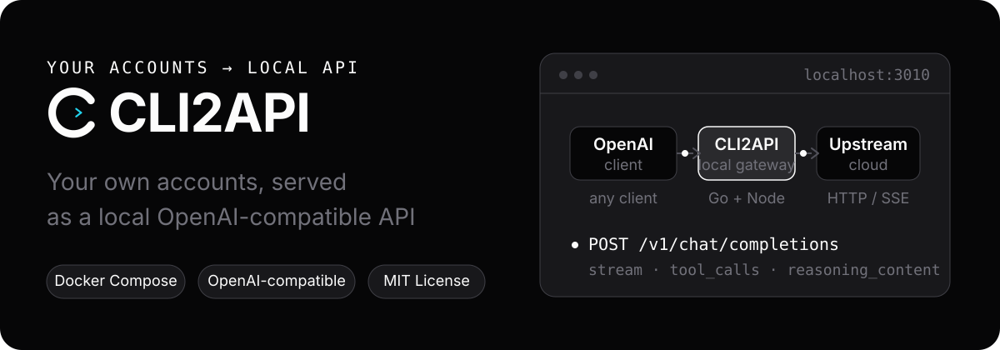

<div align="center">

<h1> CLI2API</h1>

**Turn your own logins into a local OpenAI-compatible API**

Connect **Qoder (Global / CN)**, **WorkBuddy (Global / CN)**, **Trae CN Work**, and experimental **Devin** accounts.

Deploy with Docker, manage accounts in the web console, and connect clients through compatible APIs.

[](LICENSE)
[](https://linux.do)

<sub>[中文](README.md) · [Issues](https://github.com/caigee-cmd/cli2api/issues) · [LINUX DO](https://linux.do)</sub>



</div>

## Features

- **Compatible APIs**: Chat Completions, Responses, Anthropic Messages, and model listing, with streaming and function tools.
- **Multi-account routing**: automatic selection, session affinity, concurrency limits, cooldowns, and failover.
- **Web console**: manage accounts, models, client keys, and proxies; view quotas and request logs.
- **Docker operations**: persistent account data; an optional host updater lets you download, confirm, and roll back updates from the console.

Qoder CN, WorkBuddy, and Trae adapters are implemented, but live-account acceptance is still pending. Devin is experimental, not production-ready. Live upgrade and rollback acceptance is also pending.

## Quick start

You need Docker and an upstream account you control. Use Docker Desktop on macOS / Windows; Windows must use Linux containers.

```bash
git clone https://github.com/caigee-cmd/cli2api.git
cd cli2api
./scripts/start.sh        # Windows: scripts\start.ps1
```

1. Save the **administrator key** printed in the first-start logs.
2. Open `http://127.0.0.1:3010`, sign in with that key, and add an account in **Accounts**.
3. Create a client key in **API keys**, then choose a model and test it in **Access**.

Docker Compose is the supported install and managed-update path; source runs are for development. See the [deployment guide](deploy/README.md).

## Connect a client

In an OpenAI-compatible client, enter:

```text
Base URL: http://127.0.0.1:3010/v1
API Key:  <a client key created in API keys>
```

Get a model ID from **Access** or `/v1/models`. Routing is automatic and prefers the same account for later turns. Account pinning, session headers, and curl / PowerShell examples are in the [deployment guide](deploy/README.md).

## How it works

<p align="center">
  
</p>

The Go gateway handles authentication, routing, and request logging. Each Qoder account has its own Node process and HOME; WorkBuddy, Trae, and Devin use Go in-process adapters. No full CLI is started per request.

## Console

<p align="center">
  
</p>

Accounts, models, access, and logs all live in one web console: readiness and quota are visible at a glance, and the Access page lets you copy the Base URL and run a quick check.

Account cards provide WorkBuddy and Qoder CN check-in actions and automatic check-in switches (off by default), with history under More → Check-in records; no separate check-in page is needed. Set each provider's default time under System → Automatic check-in, then choose inheritance or an override in Edit account. Default changes apply to inheriting accounts immediately. Existing WorkBuddy accounts retain their previous times until switched to inheritance. Qoder Global has no check-in controls; inactive CN campaigns are skipped. Live-account check-in acceptance is still pending.

## Limitations

- Bring your own accounts. CLI2API does not supply accounts, quotas, or an official API service.
- Compatibility is not full API parity. Messages / Responses are stateless adapters, without server-side conversations or upstream-specific tool execution.
- Image support depends on the upstream and model. WorkBuddy / Trae do not support images; file inputs are rejected. See the [deployment guide](deploy/README.md) for details.
- Cross-provider routing for shared model IDs follows system settings, key grants, and region constraints; failover is not unrestricted.
- Upstream changes can break compatibility. Request logs do not store prompt or completion bodies by default.

## Documentation

- [Deployment and operations: setup steps, environment variables, endpoints, managed updates](deploy/README.md)
- [Changelog](CHANGELOG.md)

## Security

The default deployment exposes only `127.0.0.1:3010`; do not expose it directly to the public internet. Administrator keys manage the console; client keys only access `/v1/*`. Protect keys, credential exports, and database backups. Report security issues privately as described in [SECURITY.md](SECURITY.md).

## Community & Contributing

Chinese-language discussion is on [LINUX DO](https://linux.do). Bugs and feature requests go to GitHub [Issues](https://github.com/caigee-cmd/cli2api/issues); documentation improvements and pull requests are welcome — see [CONTRIBUTING.md](CONTRIBUTING.md).

## License

[MIT](LICENSE). Follow each upstream platform's terms when using its accounts.
